# Rooms

All non-elite battles can only happen once per run.  
The first two battles you find will be "easy battles"  
After that they will be "random battles"

## Easy Battles:
 - EntryEncounter (Note: Not actually guarenteed to be the first encounter) 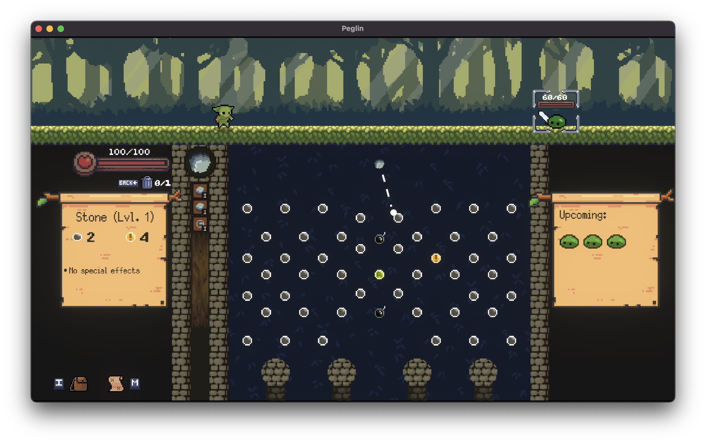
 - Bats1 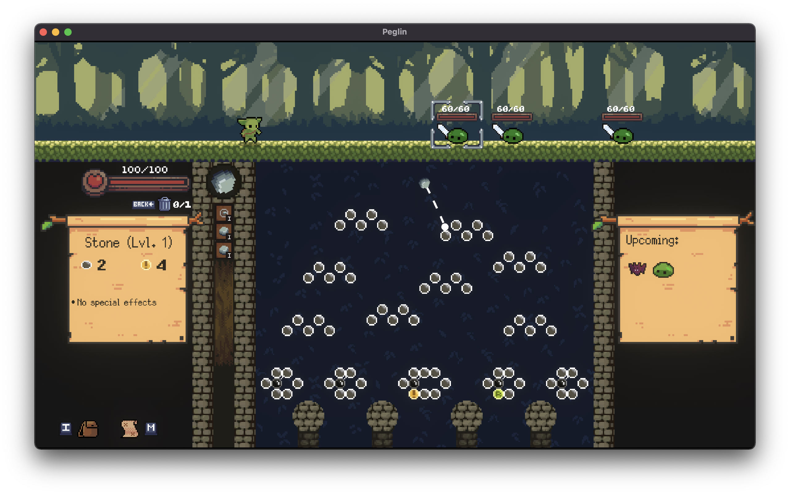
 - SlimeEncounter2 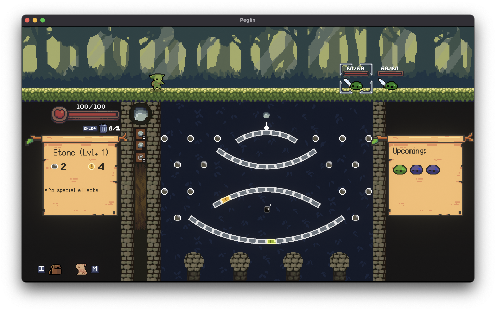
 - SlimeEncounter3 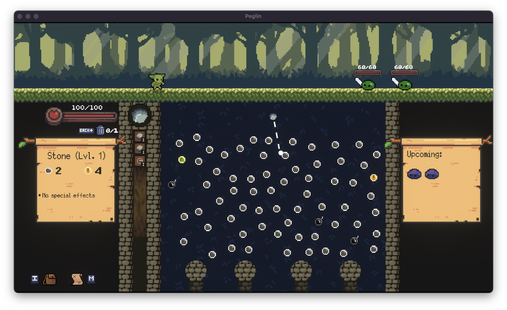
 - PlantEncounter1 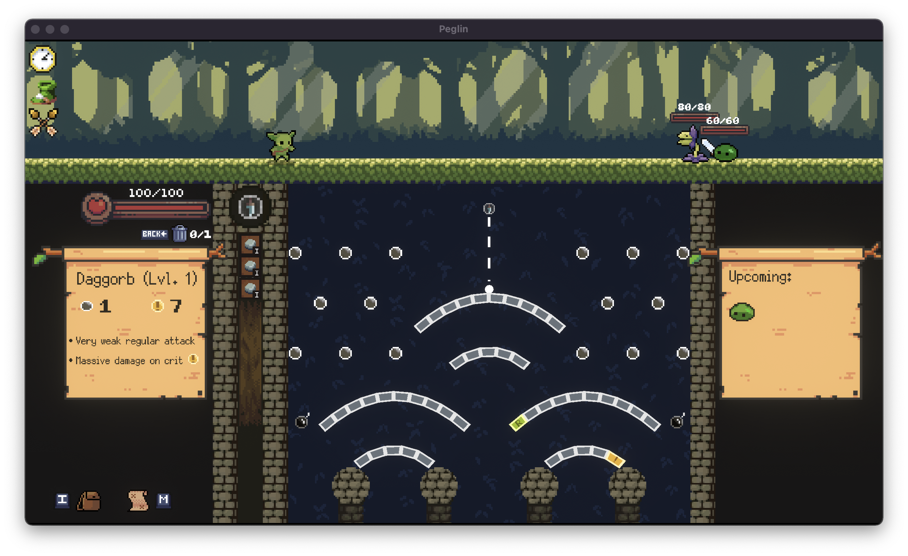
 - MuchoSlimeEncounter_Easy 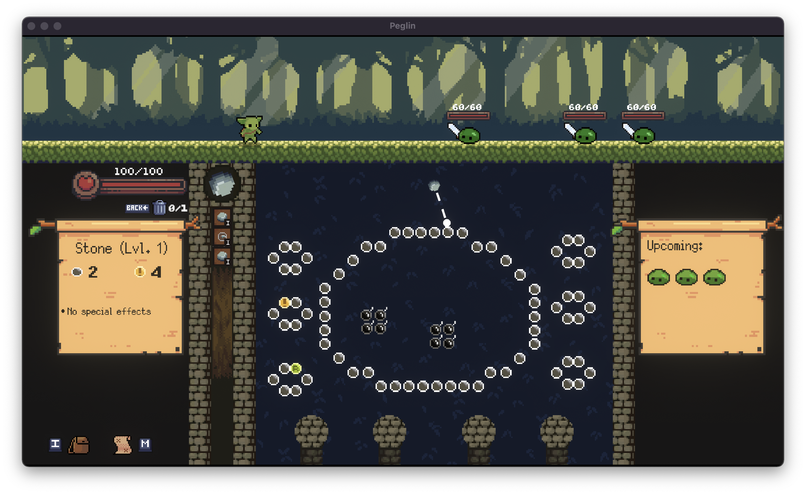
  
## Random Battles:
 - Bats2 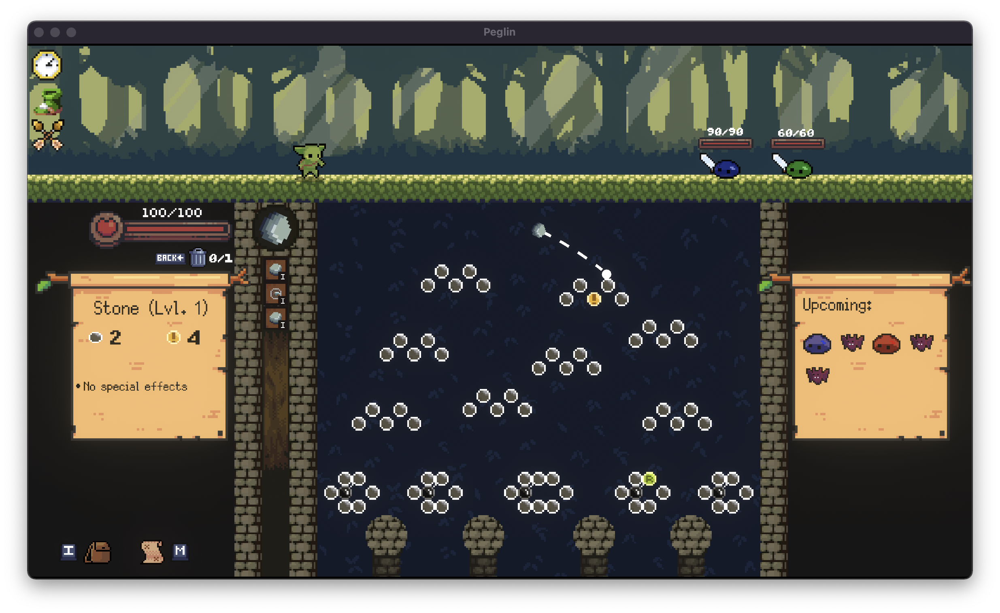
 - Everything 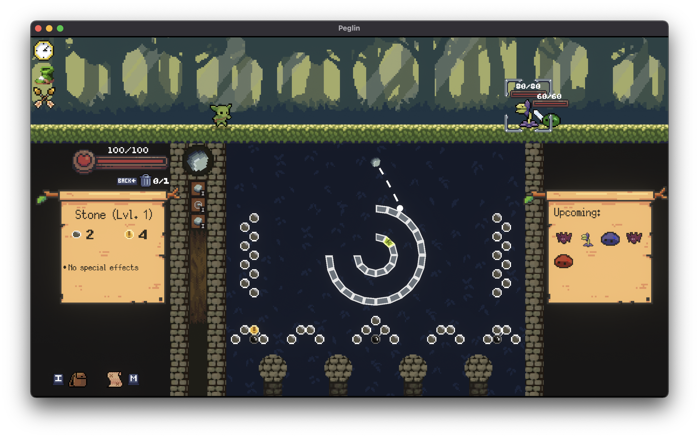
 - MuchoSlimeEncounter 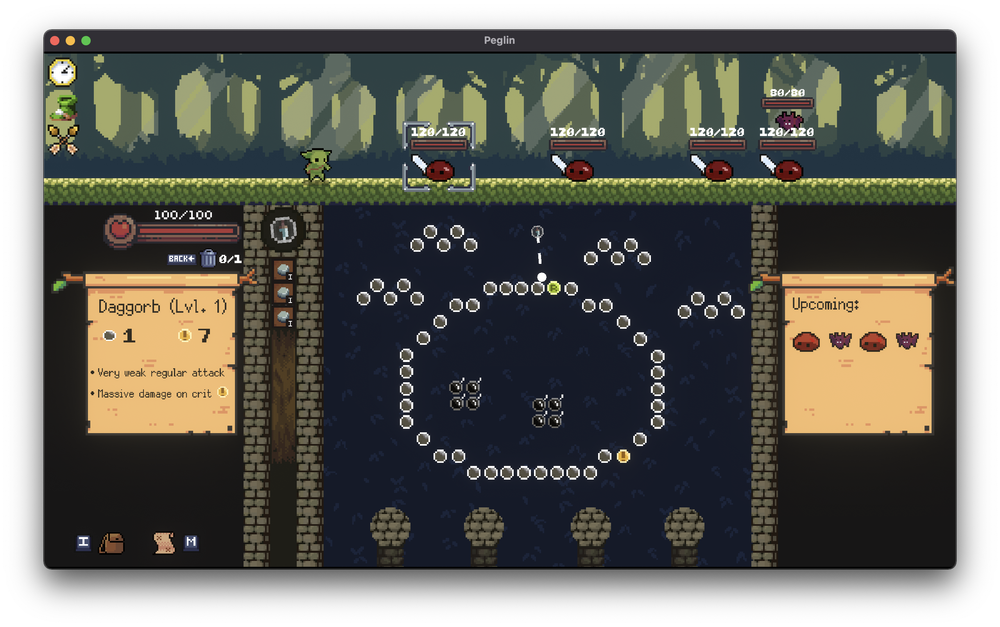
 - SlimeEncounter4 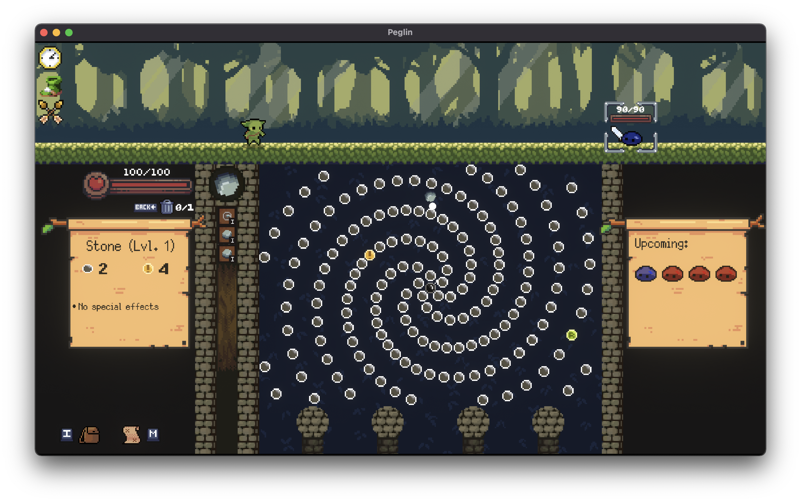
 - PlantEncounter2 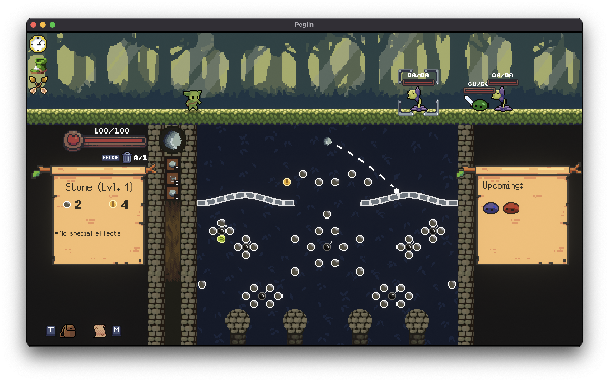
 - ONLYBATS 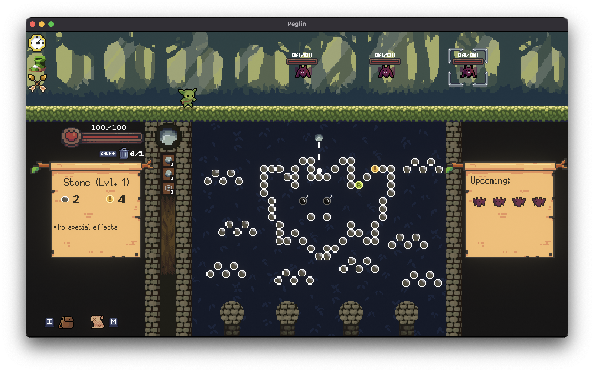

## Elites:
 - MinotaurBossEncounter
 - PlantMiniboss
 - SlimeMiniBossEncounter_HARD

## Scenarios:

Some scenarios can only happen once per run, while others can happen multiple times.

 - BrambleTree: Not repeatable
 - SunnyClearing: Repeatable
 - Thunderstorm: Not repeatable
 - MysteriousAltarOffer: Repeatable
 - SlimyPath: Not repeatable
 - CrowClearing: Not repeatable
 - Inferno: Not repeatable
 - HaglinScouting: Repeatable
